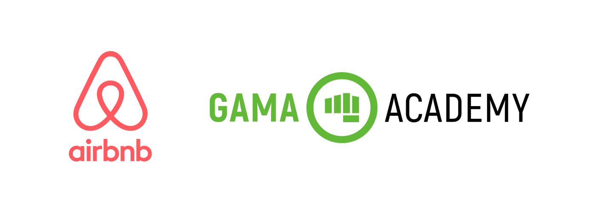
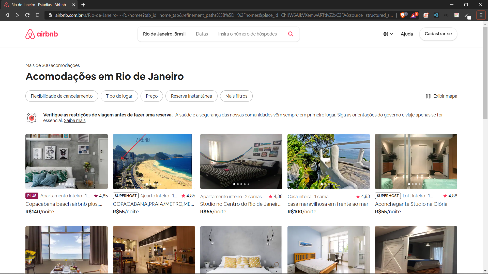
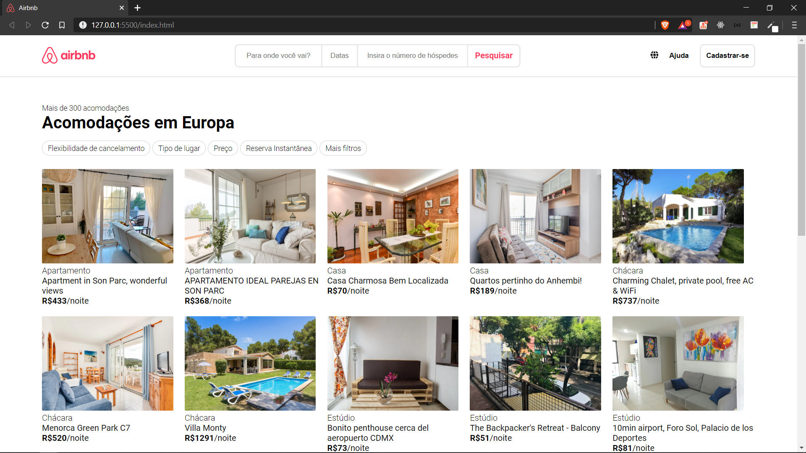

<h1 align=center>Desafio: Quartos do Airbnb </h1>  

  

## Sobre o desafio

O desafio foi criar uma página similar a do Airbnb através do consumo da API de quartos, usando Javascript Vanilla e Flexbox para organizá-los em cards na tela, a partir deste banco de dados: https://api.sheety.co/30b6e400-9023-4a15-8e6c-16aa4e3b1e72.

### Resultado esperado: 
Tela com cards contendo: 
- Imagem
- Tipo de propriedade
- Preço

<h1 align=center>Original</h1>

  

<h1 align=center>Minha versão</h1>

  

